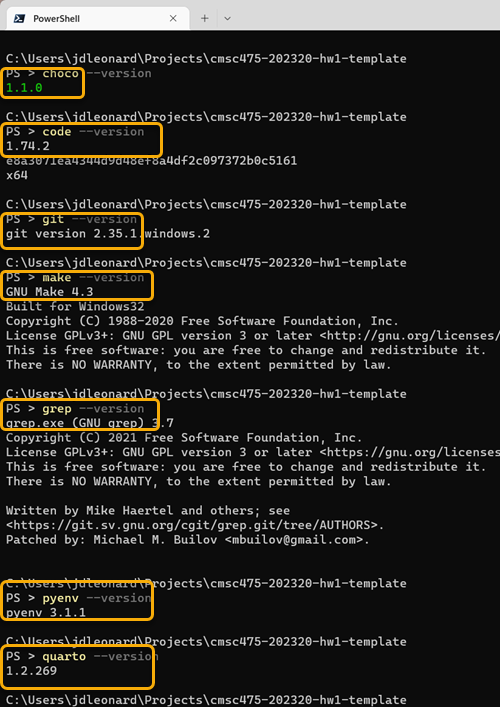

CMSC 475 - Homework 1
----------------------

Homework 1 is all about getting the software and tools to be used in CMSC475 installed and running on your machine. Why not get course credit for doing the work?

Friday lecture will be dedicated as a "laptop party".  Bring your laptop and plan on installing the necessary software. I'll be walking through the installs, answering questions, and otherwise making sure that everything required for the first parts of the class are up and running.

At the end of Friday or at the end of this homework assignment, you'll have most of the software tools for this class installed and verified that they run.

## Instructions

- Install the software tools below, then
- Submit one or more JPG/PNG files showing the versions in a command line terminal.
- Use "snip" or some other tool to create the screen snips,
- Below is an example of a PNG file to stored in this project folder.
- Your submission DOES NOT NEED any yellow boxes.

## Detailed instructions

### Step 1 - open a command line terminal or window

Yep. We're doing it. We're going to live at the command line for a while! In fact, you can expect to be asked to develop a command line *user interface* for one of our homework assignments.

I add an icon on my task bar to quickly open a command line terminal. You should, too!

- **If you're on windows, you'll need to open an administrator terminal.  <right-click> on your terminal icon and select *Run as administrator*.**

- **If you're on mac or linux, you'll need to run the package manager with *sudo* privileges**.

### Step 2 - install a package manager

- [Chocolatey (on the PC)](https://chocolatey.org/install) or [Homebrew (on the Mac)](https://brew.sh)

### Step 3 - Review the list of packages to install

Using choco or brew, install the following the packages below if they aren't already installed on your machine. 

You can use older versions on your machine, or you might want to consider uninstalling the old versions and installing fresher versions using the package managers.

Below is a description of the tools we're going to install. The links below point to the chocolatey package page that describe how to install the software.

You can find similar links to the homebrew versions at the [homebrew formulae page](https://formulae.brew.sh/).

**You'll need to install the software from an elevated account**

- [vscode](https://community.chocolatey.org/packages/vscode) - a good text editor that runs on windows, mac and linux (and raspberry pi, too!) A good cross-platform tool with lots of good extensions.
- [git](https://community.chocolatey.org/packages/git) - a free and open source distributed version control system designed to handle everything from small to very large projects with speed and efficiency. We use it to connect to GITHUB, which offers free (but public) storage of source code and other goodies. I use GIT for just about everything!
- [make](https://community.chocolatey.org/packages/make) - a build automation tool that automatically builds executable programs and libraries from source code by reading files called Makefiles which specify how to derive the target program. Though integrated development environments and language-specific compiler features can also be used to manage a build process. make first appeared in 1976. It's been around a while, and it's still awesome!
- [grep](https://community.chocolatey.org/packages/grep) - a command-line utility for searching plain-text data sets for lines that match a regular expression. Its name comes from the ed command g/re/p (globally search for a regular expression and print matching lines). grep was first introduced in 1973.
- [awk](https://community.chocolatey.org/packages/awk) - a domain-specific language designed for text processing and typically used as a data extraction and reporting tool. Like sed and grep, it is a filter, and is a standard feature of most Unix-like operating systems. awk was first release in 1977.
- [pyenv-win (or pyenv)](https://community.chocolatey.org/packages/pyenv-win) - a simple python version management tool. It lets you easily switch between multiple versions of Python. It's simple, unobtrusive, and follows the UNIX tradition of single-purpose tools that do one thing well.
- [quarto](https://community.chocolatey.org/packages/quarto) - an open-source scientific and technical publishing system built on Pandoc.
- [processing](https://community.chocolatey.org/packages/Processing) - a flexible software sketchbook and a language for learning how to code. Since 2001, Processing has promoted software literacy within the visual arts and visual literacy within technology. There are tens of thousands of students, artists, designers, researchers, and hobbyists who use Processing for learning and prototyping.
- [node.js]()

### Step 4 - install the packages

The code below is for windows:

    choco install -y vscode
    choco install -y git.install --params "'/GitAndUnixToolsOnPath /WindowsTerminal /NoAutoCrlf'"
    choco install -y make
    choco install -y grep
    choco install -y awk
    choco install -y pyenv-win
    choco install -y quarto
    choco install -y processing
    choco install -y nodejs

Although not tested, the following commands *should* work on mac.

    brew install --cask visual-studio-code
    brew install git

See the [homebrew formulae page](https://formulae.brew.sh/) for the other recipes.
    

**After everything is installed, close all the terminal windows (on either platform) and reopen as necessary.**

### Step 4 - installing python tools

- [python (using pyenv)](https://github.com/pyenv/pyenv#install-additional-python-versions)
- [poetry - (using PIP from the python you just installed.)](https://pypi.org/project/poetry/)

### Step 5 - Verify installation and prepare for submission

Here is some code that will run on ANY terminal:

    clear
    choco --version
    code --version
    git --version
    make --version
    grep --version
    awk --version
    pyenv --version
    quarto --version
    node --version

Verifying processing is more difficult. Start processing from the command line and take a screen shot of the opening window.

    processing

### Step 6 - Create PNG

- Create snips of terminal windows showing the version numbers of the software installed. You can have more than one!

- Store the PNG in the root directory of this folder, along with this Readme file.

### Step 7 - Commit this modified repo

    git add -A
    git commit -a -m "pushing my screen shots"
    git push

### Step 8 - Submit the amended repo to gradescope

I'll be using gradescope to review your submissions. You **MUST** push your local changes to GITHUB. I cannot see the changes on your local machine.

Visit [gradescope](https://www.gradescope.com/courses/488530) and following the instructions for posting your GITHUB repo for my review.
